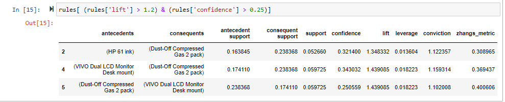
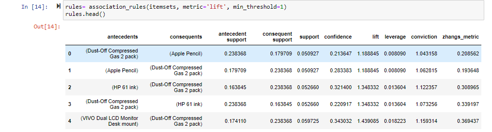
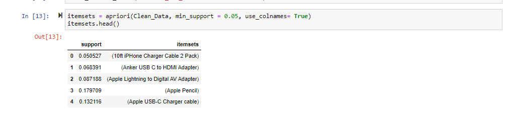
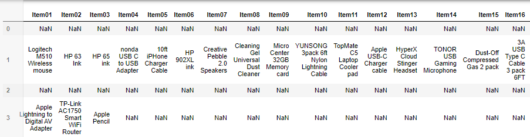

Association Rules and Lift Analysis

Part I: Research Question

A.

1.  Product recommendation and placement are crucial in maximizing revenue by acknowledging customers’ underlying spending habits. There tend to be item pairs or groups that are bought together, and recognizing those habits allows the business to provide recommendations that are better suited to its customer base’s spending trends. This presents the question, what purchase suggestions should the company make?

2.  The goal of the analysis is to determine which items are frequently bought together with relevant metrics to prune the list, such as support, lift, and confidence.

Part II: Market Basket Justification

B.

1.  Market basket analyzes the data by comparing counts of transactions in an if x then y format with an antecedent, x or the preceding item(s), and a consequent, y or the succeeding item(s). It is expected that market basket analysis will provide a list of rules that provide a meaningful insight into common customer transaction combinations (Randeniya, 2023). The list of rules will be accompanied with metrics such as lift, confidence, and support.

2.  An example of a transaction is in row 3 of the data set.

Row 3’s transaction consists of 3 items.

3.  The primary assumption of market basket analysis is that customers who purchase an item, or items, are more predisposed to purchasing another item or group of items (Indeed, 2022).

Part III: Data Preparation and Analysis

C.

1.  Please see the zip file for the attached clean data set.

2.  Execute the code used to generate association rules with the Apriori algorithm. Provide screenshots that demonstrate that the code is error free.

3.  Provide values for the support, lift, and confidence of the association rules table.

4.  The top 3 rules are:

HP 61 ink, Dust-Off Compress Gas 2 Pack

Vivo Dual LCD Monitor Desk mount, Dust-Off Compress Gas 2 Pack

Dust-Off Compress Gas 2 Pack, Vivo Dual LCD Monitor Desk mount

This means that when a customer purchases the first item, there is good evidence to support the customer buying the second item.

Part IV: Data Summary and Implications

D.

1. From the analysis, we see that for rule 1, the support is 0.0527, the confidence is 0.3214 and the lift is 1.3483. This means that this pairing occurs in 5.27% of all transactions, that when the HP 61 ink is bought, the Dust-Off Compressed Gas 2 pack is bought 32.14% of the time, and that when the HP 61 ink is bought, compressed gas is bought 34.83% more often than typical.

For rule 2 the support is 0.0597, the confidence is 0.3430 and the lift is 1.4391. This pairing occurs in 5.97% of all transactions. When the VIVO Dual LCD Monitor Desk mount is bought, the Dust-Off Compressed Gas 2 pack is bought 34.30% of the time, and when the VIVO Dual LCD Monitor Desk mount is bought, compressed gas is bought 43.91% more often than typical.

For rule 3 the support is 0.0597, the confidence is 0.2506 and the lift is 1.4391. This pairing occurs in 5.97% of all transactions. When the Dust-Off Compressed Gas 2 pack is bought, the VIVO Dual LCD Monitor Desk mount is bought 25.06% of the time, and when the compressed gas pack is bought, the monitor desk mount is bought 43.91% more often than typical.

2.  The practical significance of the aforementioned findings is that the purchase of HP 61 ink has a noticeable increase on the likelihood that the compressed gas 2 pack is purchased, and that the dual LCD monitor desk mount and the compressed gas 2 pack both have a positive impact on if the other item is purchased.

3.It is recommended that the company suggests the compressed gas 2 pack to customers who have purchased or are purchasing the HP 61 ink or the dual LCD monitor desk mount, and that the company recommends the dual LCD monitor desk mount to customers who have purchased or are purchasing the compressed gas 2 pack. If the company operates a physical location, these items should be placed together in such a way that the compressed gas is next to both the monitor stand and the HP ink.

Part V: Attachments

E.

1.  Please see the provided link for the Panopto video.

F.  Code sources:

Data Mining II - D212. Panopto. (n.d.). https://wgu.hosted.panopto.com/Panopto/Pages/Viewer.aspx?id=dbe89ddb-e92f-4d40-a87a-af030178abf1  (Data transformation and additional pruning)

Identifying frequent itemsets with Apriori. Python. (n.d.). https://campus.datacamp.com/courses/market-basket-analysis-in-python/aggregation-and-pruning?ex=6 (Apriori code)

Pruning with lift. Python. (n.d.-b). https://campus.datacamp.com/courses/market-basket-analysis-in-python/aggregation-and-pruning?ex=10 (Association rules code)

G.  Sources:

Indeed Editorial Team. (2022, October 12). What Is Market Basket Analysis? (Types Plus Examples). FAQ: What Is Market Basket Analysis? (Types Plus Examples). https://sg.indeed.com/career-advice/career-development/market-basket-analysis

Randeniya, M. (2023, April 16). Performing a market-basket analysis using the Apriori algorithm - python. Medium. https://medium.com/@randeniyamalitha08/performing-a-market-basket-analysis-using-the-apriori-algorithm-python-8a11742253dd

