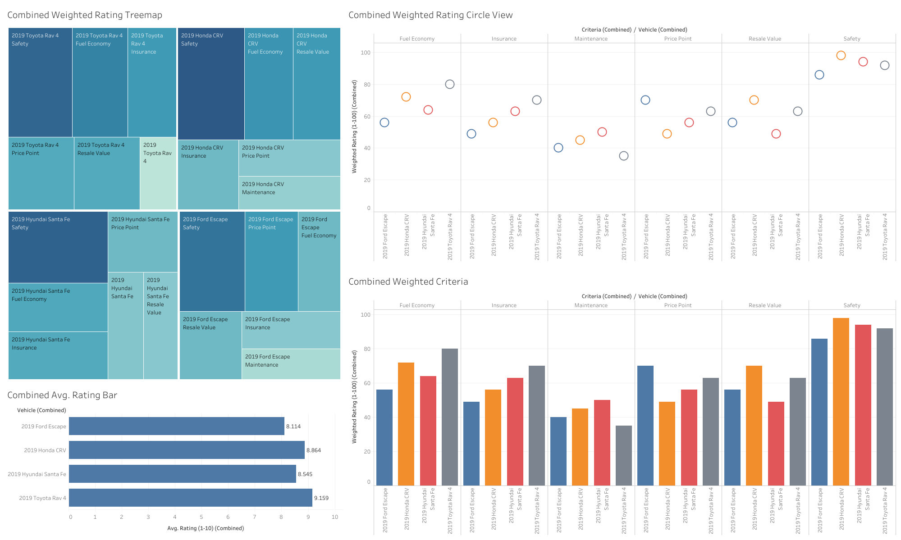

<h1 align="center">🚗 Car Comparison Dashboard </h1>
 
This Tableau dashboard compares various car models across key performance and cost metrics.

> **Click the image above** to open the fully interactive version on Tableau Public.

<h3 align="center"> Decision Rationale </h3>

After analyzing multiple vehicles across key performance and cost categories, the 2019 Toyota RAV4 emerged as the best choice.

It achieved the highest average combined rating at 9.16.

It ranked highest in fuel economy and insurance cost.

While it had the highest maintenance cost, this was offset by it being the second‑cheapest vehicle among the four and having the second‑highest resale value.

This combination of factors made the Toyota RAV4 the most balanced and cost‑effective option overall.

<h3 align="center"> Storytelling with Data </h3>
As Dykes (2016) explains, storytelling with data involves “a combination of three key elements: data, visuals, and narrative.” I applied these principles in my analysis and presentation to my manager:

1. **Data**
I ensured that all data was accurate, consistent, and aligned with the project goals. To maintain reliability, I used the same sources for each criteria when possible.

2. **Visuals**
I created clear and effective visual comparisons that were easy to interpret without being oversimplified or unnecessarily complex. This allowed for quick insights while maintaining analytical depth.

3. **Narrative**
As Yau (2011) notes, “a standalone chart is no longer good enough.” To provide context and guide decision‑making, I included commentary, when presenting, on each slide. For example, I highlighted the long‑term savings potential of the RAV4’s fuel efficiency. These insights reinforced my recommendation and helped my manager fully understand the rationale for selecting the RAV4.

 
 
 
 
 
 
 
 

Sources
Dykes, B. (2016, March 31). Data storytelling: The essential data science skill everyone needs. Forbes. Retrieved May 14, 2022, from https://www.forbes.com/sites/brentdykes/2016/03/31/data-storytelling-the-essential-data-science-skill-everyone-needs/?sh=75b0f21652ad 
Yau, N. (2011). 9. In Visualize this: The flowingdata guide to design, visualization, and statistics (pp. 329–329). essay, Wiley Pub. 

Best cars, Best Trucks, and best suvs | U.S. News & World Report. US News Best Cars. (n.d.). Retrieved May 16, 2022, from https://cars.usnews.com/cars-trucks 

New cars, used cars, car reviews and pricing. Edmunds. (n.d.). Retrieved May 15, 2022, from https://www.edmunds.com/ 

Kelley Blue Book | new and used car price values, expert car reviews. (n.d.). Retrieved May 16, 2022, from https://www.kbb.com/ 
