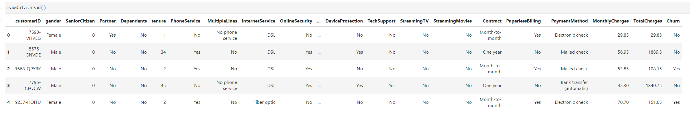
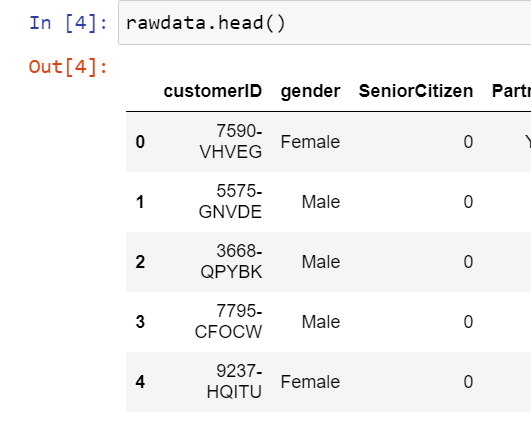

# Customer Churn - Extended Analysis

Python was chosen due to the expansive list of libraries, my familiarity with the program, and the usefulness of Jupyter notebooks, which allows me to segment the code and document it for the assignment more easily. I would have chosen R next due to its expansive library, and because while it isn’t as fast it is extremely flexible (Shahid, 2021). SAS was not considered as although it is a great tool and used by many corporations, it isn’t open source and is quite costly.

The objectives of the data analysis are to dive deeper into customer churn and see what factors are contributing the most to it so that a plan to address those aforementioned factors can be developed and put into place.

For the descriptive method, correspondence analysis will be used. Correspondence analysis is the best choice as the method will assist in dimension reduction while also being compatible with several graphs to make the data more understandable. Logistic regression will be used for the predictive nondescriptive method as logistic regression allows for an analysis of multiple variables at once and can be used to determine not only the likelihood and accuracy of churned but also for validation in dimension reduction by comparing the accuracy between a model that uses all of the of the variables versus one that only uses the most important.

The target variable is churn and its type is binary. There are only two choices within the category, yes and no (whether the customer churned or not). All other variables are used to explain and predict why the customers churned.

SeniorCitizen is a categorical binary with 0 or 1 as possible answers. There are only two possible outcomes, 0, the person isn’t a senior citizen, or 1, the person is a senior citizen.

The goal is to reduce the independent variables to a true/false binary so that it is easier to compare each factor against one another. This helps in ease of interpretation, analysis, and explanation by reducing the data in that way. This change not only constitutes a type change but also reformatting columns in a way that other categorical variables can be simplified into that two-answer binary.

Prior to any adjustments there is one column that is of the float type, two that are integers and 18 that are categorical.

As we can see there are some types that would be better represented in another data type. The most obvious of which are SeniorCitizen, and TotalCharges. SeniorCitizen is already in a Boolean format with 0s and 1s but the data is currently read as an object. The TotalCharges column is essentially a float as the values are in the same format as the MonthlyCharges column.

After using the describe command, we can see the statistical information provided for all the columns currently considered numerical in value prior to any changes in format.

Firstly, the columns for “customerID” and “TotalCharges” were dropped. Then I converted the categories to Boolean values (true and false). The continuous data was removed or converted to Boolean values as well by reducing the detail the data contains, such as was the case for “MonthlyCharges” and “tenure”. The mean values of both columns were taken and columns for “HighCharge?” and “LongTenure?” were created. If the value was equal to or greater than the mean value, then the respective new columns would receive a True, on the other hand, if the value was lower than the median, it would receive a False. There were not any missing data points for the data used and there were no anomalies as confirmed by the describe command. For columns with 3 values, the column would be renamed to convert the values into a binary. An example of this was with the “Contract” variable. The data was originally a trinary with data for one year, two year, and month-to-month. To reduce this to a binary the column was renamed “contract?” and both one year and two year were converted to True, as they were in a contract, and month-to-month was converted to False. This was done to narrow down the relevant variables the data contains.

To identify the distribution of variables using univariate statistics, bar graphs were used to represent the remaining variables after they were converted to the Boolean type. As we can see from the charts below, most of Telco’s customers are not senior citizens and a slightly smaller majority have churned. It is a roughly 50/50 split for the customers to be a male or not, and to have a partner or not. Most customers have phone service, do not have multiple lines, have internet, and if they have internet, are more likely to have fiber than DSL, have not opted in for online security, online backup, device protection, or tech support. The majority of customers do not stream TV or movies, are not in a contract, have a higher-than-average charge, have been customers for less than the average amount of time, have opted in to paperless billing and pay online.

  

For the bivariate variable statistical analysis, bar graphs were also used with each variable being simultaneously split based on whether churn was true or false to help identify the variables that have the highest degree of churn. A heatmap was also created based on the correlation of each variable with one another. As can be seen from below senior citizens, customers without partners or dependents, have phone service, multiple lines, and fiber optic, do not have DSL, online security, online backup, online security, device protection or tech support, do not stream movies or tv, are not in contract, have a higher-than-average monthly charge, have a lower-than-average tenure, utilize online payment and paperless billing are more prone to churn. The likelihood of churn based on the sex of the customers is practically 50/50.

From the heatmap, the correlation between each variable within the data is displayed. The closer to peach the color is, the more they positively correlate, while the closer they are to dark burgundy, the closer they are to zero correlation.

  

  

Correspondence analysis was used to help evaluate the data. This was then used to pull the eigenvalues and plot a screeplot. We can see that the first 6 principal components contribute over 70% of the variance. There also is not a significant decrease in contribution until principal component 6.

  

SelectKbest was also used to further analyze which variables had the most impact to narrow down the variables most influential to ‘Churn’. As determined from the eigenvalues, the top 6, 'Contract',' FiberOptic', 'LongTenure?', 'OnlineSecurity', 'TechSupport', and 'SeniorCitizen', were kept.

Logistic regression was used for the evaluative method. The logistic regression was run twice, once with all of the data and a second time with the top 6 variables from above. As we can see, the logistic regression with all of the variables is marginally more accurate at 80.62% accuracy but the logistic regression with the top 6 manages to capture the majority of that information at 79.56% accuracy with significantly less predictor variables.

SelectKbest was used to narrow down the number of features to a more manageable amount based on the Chi-squared score. SelectKBest was used over other methods such as RFE as it allows us to see the relationship between each variable clearly and, based on the eigenvalues we obtained earlier, the main drawback of having to manually set how many features to retain is negated (Vatvengers, 2021).

Correspondence analysis was chosen over methods like PCA and MCA because PCA typically deals with variables that have a larger categorical range such as 1-10 instead of just binary, and MCA works with a data set with more dimensions than the dataset being used (Bock, 2020).

Logistic regression was used as the evaluative method because the data is categorical and binary so it very easy to evaluate. It also is “easy to implement and easily interpretable” (DataCamp, 2019). While there are other methods available, with logistic regression being so commonly used and simple, the data is very easy to present and explain. The model was also very accurate with an accuracy of 79.56%. There are other categorical models such as random forest, but logistic regression was chosen over this as according to Kirasich et al. (2018) depending on the variance “logistic regression consistently performed with a higher overall accuracy as compared to random forest”.

There were many different methods used to present the data depending on the type of data being presented. Bar graphs were used as the method of presenting the quantity of the univariate and bivariate data as quantity is continuous and bar charts are a great easily understandable way of displaying continuous data. Similarly, the scores for Kbest were quantitative, so horizontal bar charts were used. A heatmap was used to present the correlation data as it demonstrates not only the interactions between each variable with one another, but also the degree of the interaction while remaining compact and easily comparable. A scatter plot was used for correspondence analysis as there were thousands of data points with a plottable location. A scree plot was used to display the principal component data as this is customary to use with eigenvalues. It also helps keep the data simple and allows the information to be understood at a glance. Confusion matrixes were used to show the accuracy of the logistic regressions. This was used as this is a very easy to interpret way of not only representing what was predicted but also what the outcome was. The aforementioned methods were used as they are easily understandable and commonly used. This translates to a quicker more impactful understanding of the data; there are many variables to analyze and many graphs to understand so keeping it compact and digestible are imperative.

The data is discriminating as from the data you can predict an outcome. There are 2 groups that are of importance in this analysis, those who churn and those who do not. As seen in the above sections with logistic regression we can reasonably accurately, 79.56%, predict whether a customer will fit into one of these two groups.

The first step in determining the most important predictor variables was made by obtaining the eigenvalues. After the eigenvalues were determined, the number of predictor variables was selected by determining what quantity of principal components are needed to explain >70% of the variation. In this case, 6 were determined to be the most important and retained.

For predicting the most important predictor variables Kbest was used. The top 6 were then kept and chosen to be the most impactful features.

Just for verification I looked at the correlation data for all the predictor variables regarding churn and the absolute value of each of the above columns were in the top 10 for correlation.

Sources:

Bock, T. (2020, November 19). Correspondence analysis versus multiple correspondence analysis: Which to use and when? Displayr. Retrieved September 1, 2022, from https://www.displayr.com/correspondence-analysis-versus-multiple-correspondence-analysis-use/

DataCamp. (2019, December 16). Python logistic regression tutorial with Sklearn & Scikit. DataCamp. Retrieved August 25, 2022, from

DataTechNotes. (2021, February 11). SelectKBest feature selection example in Python. SelectKBest Feature Selection Example in Python. Retrieved September 5, 2022, from https://www.datatechnotes.com/2021/02/seleckbest-feature-selection-example-in-python.html

Kirasich, Kaitlin; Smith, Trace; and Sadler, Bivin (2018) "Random Forest vs Logistic Regression: Binary Classification for Heterogeneous Datasets," SMU Data Science Review: Vol. 1: No. 3, Article 9. Retrieved September 1, 2022, from https://scholar.smu.edu/datasciencereview/vol1/iss3/9

MaxHalford. (n.d.). Prince/readme.md at master · Maxhalford/prince. GitHub. Retrieved August 20th, 2022, from https://github.com/MaxHalford/prince/blob/master/README.md

Shahid. (2021, June 18). Data science tools comparison -SAS, R, python. CodeForGeek. Retrieved August 13th, 2022, from https://codeforgeek.com/data-science-tools-comparison-sas-r-python/

Vatvengers. (2021, August 8). How to select the selection method. Medium. Retrieved September 5, 2022, from https://medium.com/@vatvenger/how-to-select-the-selection-method-c93e695da097

