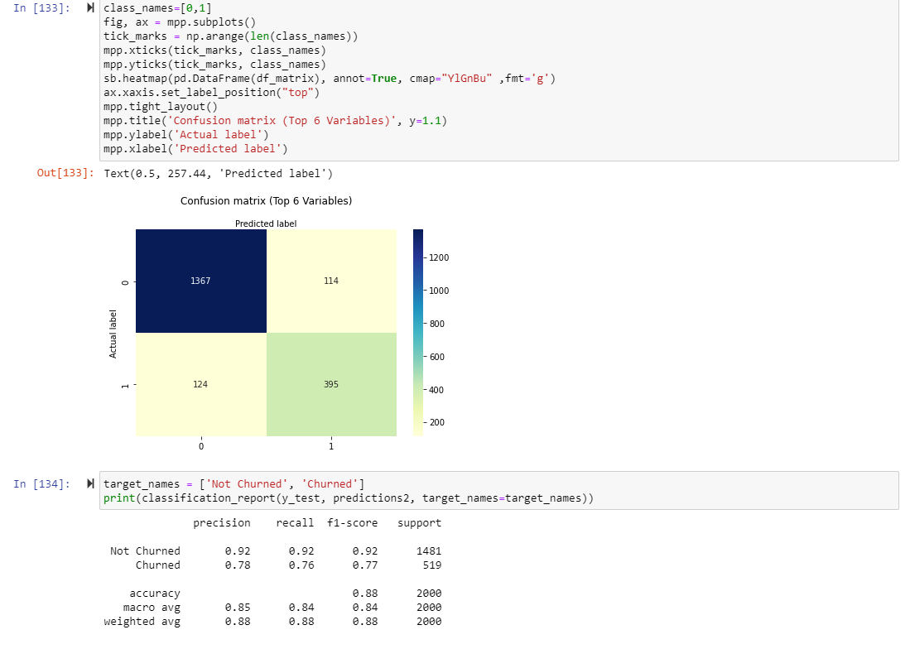
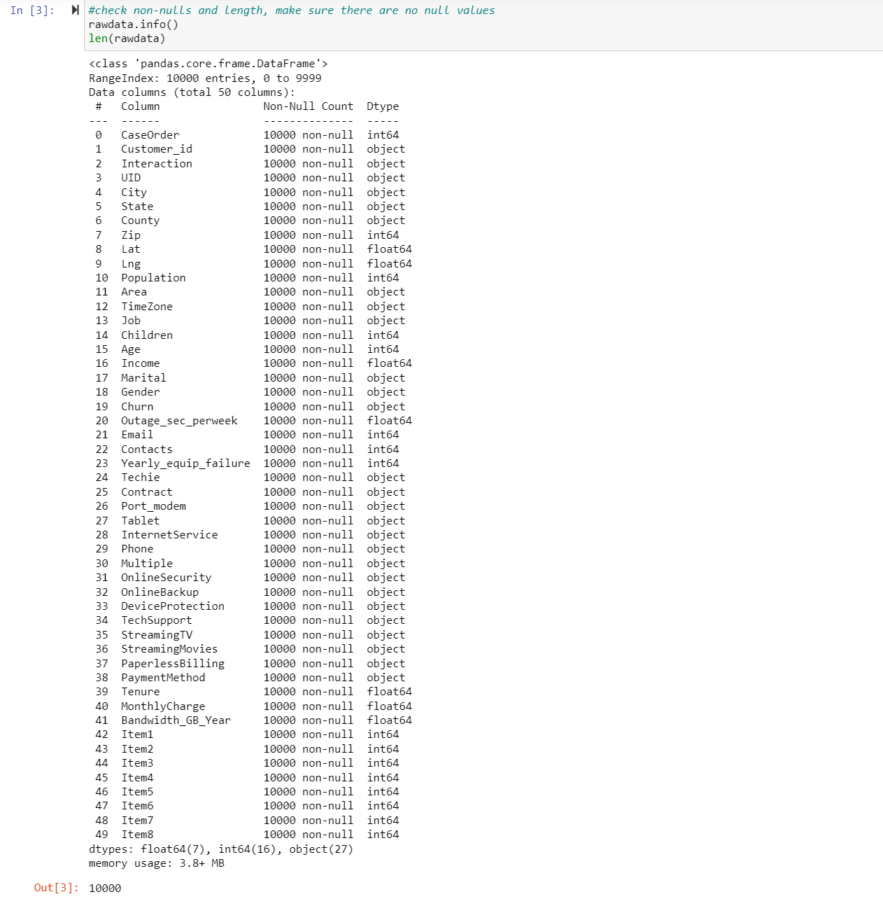

<h1 align="center">Determining Churn Utilizing Logistic Regression</h1>

Given the predictor variables, will a customer churn?

The objective of this data analysis is to determine whether a customer is expected to churn given the collected data regarding services and factors surrounding service such as demographic data. With this information, the company can better identify the steps needed to prevent churn.

The logistic regression model assumes a few things. Firstly, it is assumed that the variable is either binary or ordinal. Secondly, the observations are assumed to be independent. Thirdly, there is assumed to be no multicollinearity. Lastly, the independent variables are assumed to be linearly related to log odds (Assumptions of logistic regression 2021).

Python was chosen due to the expansive list of libraries, my familiarity with the program, and the usefulness of Jupyter notebooks, which allows me to segment the code and document it for the assignment more easily. This segmentation also allows me to troubleshoot and revise the code more easily as needed. Python is a very capable program with libraries such as seaborn, scikit, and pandas that allow for the generation, comparison, and analysis of the logistic regression models utilized below.

Logistic regression is an appropriate technique as we want to determine whether the dependent variable is binary, occurs or does not occur (What is logistic regression? 2022). In this case, the dependent variable is whether a customer churns or does not churn, which is binary.

The goal of data preparation is to ensure the data is not only clean but trimmed down into a more useable format via dimension reduction, coding the categorical variables, and dropping unnecessary variables.  The first thing to be done is to check for duplicates and nulls. After ensuring that there are no nulls or duplicates, columns with data that is too specific/not needed for the analysis will be removed.  The remaining columns are then checked for outliers and reduced to a true/false binary. Reducing the dimensionality of the data helps in ease of interpretation, analysis, and explanation. This change not only constitutes a type change for continuous and ordinal variables but also reformatting columns in a way that other categorical variables can be simplified into that two-answer binary.

The target variable is churn which is binary. The predictor variables can be seen below with each object datatype representing categorical variables, and the float and int datatypes representing continuous and ordinal variables. There are 50 variables over and 10,000 entries.

To prepare the data for analysis, the first steps are to import the libraries that will be used, importing the CSV, and checking the data for nulls and duplicates.

After checking for nulls and duplicates, the columns are checked to ensure the column name is representative of the data and to ensure that we are familiar with what is being removed. The columns are then checked for any obviously incorrect values like a negative income or negative age. Variables not needed for this analysis (Customer_id', 'Lat', ‘Lng', 'County', 'Zip', 'Interaction', 'CaseOrder', 'Job', 'UID', 'City', 'Area', 'State', 'TimeZone', 'Income', and 'Population') are then dropped.

Categorical variables are reformatted into a true/false binary by reducing the categories. This can be seen in the ‘Gender’ variable, where the variable was converted to ‘Male?’. If the value was originally Male, it results in a True in the new column, otherwise, it is false. For continuous variables with a large range and lack of zeroes such as ‘MonthlyCharge’, the values were split based on whether they were above the mean or not.  If the values are greater than the mean, then in the new column ‘HighCharge’, the customer will have a true, otherwise, it will be recorded as a false.

Continuous variables that had zeroes were split up based on whether the object being counted existed or not. For the ‘Children’ variable, if the customer had children, they would receive a true, otherwise, a false would be recorded.

The ‘InternetService’ variable was split up into two variables, one being ’FiberOptic’ and the other being ‘DSL’. In each respective column, the customer would only receive a true if they had that type of service, otherwise, it would be a false.

The survey results were coded as true or false based on importance. If the customer had responded less than or equal to 4, a true would be recorded, otherwise, a false would be recorded.

The new columns were then converted into the bool type since the variables are all in true/false binary. The old columns are then dropped.

The variables are then checked to ensure nothing was overlooked.

Univariate:

Initial Logistic Regression;

To reduce the variables, the eigenvalues were measured and plotted. Based on the eigenvalues, it was decided to narrow down the predictor variables to 9. To select the 9 predictor variables, SelectKBest was performed.

The following 9 with the highest values were chosen.

Reduced logistic regression model:

The initial model includes all the predictor variables and has a pseudo-r-squared of 0.5679, a score of 0.8775, and an overall accuracy of 0.88. The reduced model has a pseudo-r-squared of 0.5147, a score of 0.881, and an accuracy of .88. This means that the selection of variables and the reasoning given for it in section D2 hold up in testing. These variables are also statistically significant. The pseudo-r-squared decreased from the initial model, which is to be expected, however, the score marginally increased.

Reduced Regression Equation:

Y= -4.6642* High Bandwidth_GB_Year + 1.5135 * HighCharge?  + 1.4755 * StreamingMovies -3.0151 * Contract + 1.2175 * StreamingTV + 0.4077 * MultipleLines – 0.2469 * DSL + 0.5934 * Techie – 1.6187 * FiberOptic

The coefficients measure the influence on the dependent variable, churn. This influence is multiplicative and is positive or negative based on whether the coefficient is positive or negative. Positive coefficients will increase the likelihood of churning while negative coefficients will decrease the likelihood of churning. We can expect that an individual is less likely to churn if they are an above-average data user, are in a contract, or have internet service. We can also expect the customer to be more likely to churn if their bill is high, they stream movies or TV, and have multiple lines.

Limitations:

There are limitations to this analysis however with two being the most standout. The first is the sample size, the data’s accuracy could be improved with more samples. The second is that the pseudo-r-squared is quite low meaning there are other variables or aspects that are important to prediction that were not present in this analysis and should be determined.

Recommendation:

Based on the above analysis and information provided, it is recommended that the company focus on marketing towards high bandwidth users. While correlation is not causation and more research needs to be done to clarify this relationship, it appears customers that are in the top half of data users are less likely to churn. The company could also offer extended contract lengths, reduce prices with promotions, and expand access to fiber optic internet, all of which are shown to reduce the likelihood of churning.

Code Sources:

Michael GroganMichael Grogan                    87344 silver badges1010 bronze badges. (n.d.). Finding coefficients for logistic regression. Stack Overflow. https://stackoverflow.com/questions/57924484/finding-coefficients-for-logistic-regression

Sources:

Assumptions of logistic regression. Statistics Solutions. (2021, August 11). https://www.statisticssolutions.com/free-resources/directory-of-statistical-analyses/assumptions-of-logistic-regression/

What is logistic regression?. Statistics Solutions. (2022, June 14). https://www.statisticssolutions.com/free-resources/directory-of-statistical-analyses/what-is-logistic-regression/

