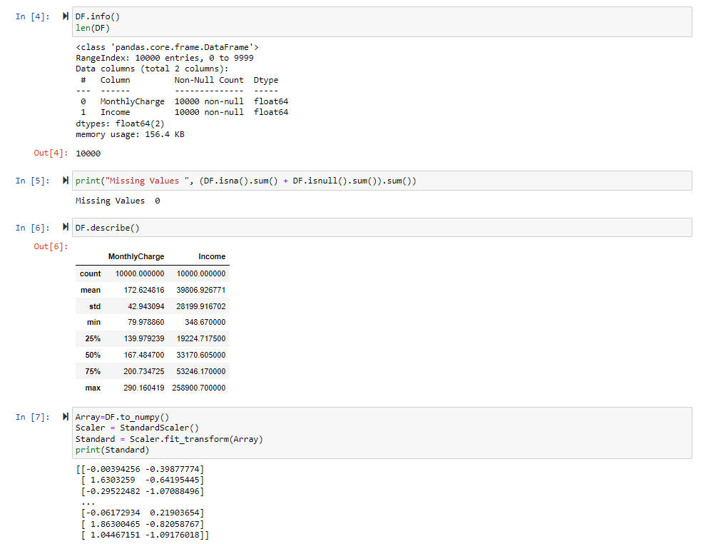
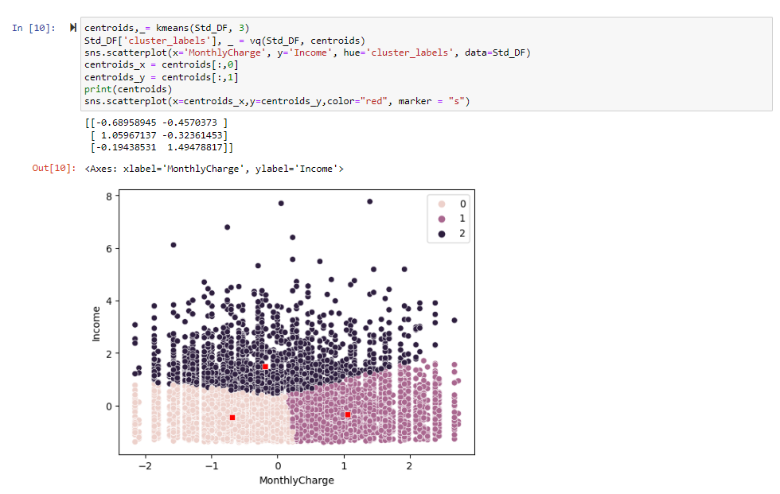
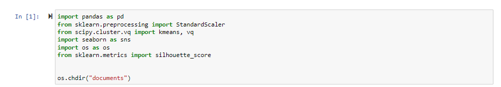
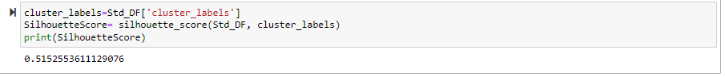
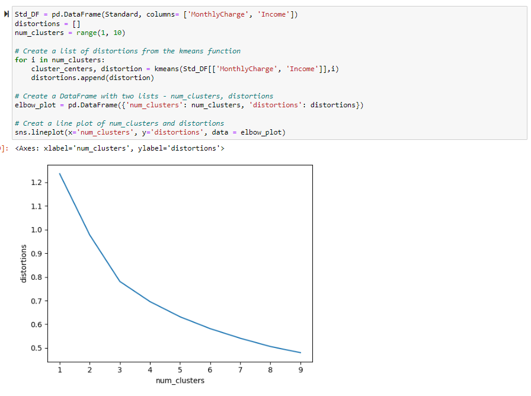

<h1 align="center">Clustering Techniques</h1>

A business’s primary goal is to maximize profit. In that regard, it is important to ascertain factors that contribute the most financially. Generally, a consumer’s demand in goods rises with their respective income level. This poses an important question, do customers who earn more income tend to pay more monthly?  I will use k-means clustering to group customers based on the two aforementioned factors.

The goal of the data analysis is to create clusters based on income level and monthly charge per customer to better market and retain high charge customers.

K-Means assigns each data point to a cluster, computes the center of each cluster, and iteratively reassigns each point to the cluster with the closest center until the cluster assigned remains constant (Machine learning - K-means). It is expected that the data will be separated into n clusters based on the results of the code, and the relation between Income and MonthlyCharge. These clusters should be visually verifiable.

K-means, the method chosen, assumes “equal variance” for “features within a cluster” (Nagar, 2020). To satisfy the equal variance assumption, the data will be standardized within the code prior to analysis.

I have listed the importation code below and the reasoning behind each one below.

import pandas as pd – Allows for the manipulation and creation of dataframes.

from sklearn.preprocessing import StandardScaler – Standardizes the data.

from scipy.cluster.vq import kmeans, vq – The clustering technique and cluster labeling method.

import seaborn as sns – The method of graphing the data.

import os as os – Allows me to change the directory for file storage/calling within the code.

from sklearn.metrics import silhouette_score – The method used to judge the quality of the K-Means clusters.

For preprocessing, I will be checking the data for null values, and, as per the necessities of k-means clustering, the data will be standardized (Dabbura, 2022).

The two variables I will be using are ‘MonthlyCharge’ and ‘Income’, which are both continuous.

Firstly, the relevant libraries were imported.

Secondly, the CSV was loaded into the coding project.

Thirdly, ‘MonthlyCharge’ and ‘Income’ were saved into a data frame.

Fourthly, the values of the two remaining columns were checked for nulls/extraneous values and standardized.

While there is a bit of subjectiveness as to the optimal quantity of clusters, I used the elbow method. With the elbow method, the number of clusters is chosen at the line graph’s bend, or “elbow” (Dangeti, 2017). As such, 3 was chosen for the suitable number of clusters as that point is the closest to resembling a bend on the graph.

For measuring the accuracy, the silhouette score was calculated. As can be seen below, the silhouette score is positive and closer to 1 than 0, at 0.515. The closer to 1 there is, the more separation, and the closer to 0, the more overlap (Samina). This indicates that the model correctly classified the data within the clusters and that the clusters are slightly more separated than overlapped.

According to the silhouette score, K-Means managed to accurately identify and classify each datapoint into one of three clusters. The potential overlap that was mentioned in the section above is demonstrated in the scatterplot below as there are no visual gaps between the clusters.

The centroids of each cluster are marked, and the locations of each cluster center are listed below.

Cluster 0’s center is the lowest on the monthly charge axis and the lowest on the income axis

coordinates -0.6896, -0.4570. Cluster 1’s center is much higher than cluster 0’s on the monthly

charge axis center and is slightly on the income axis at coordinates 1.0597, -0.3236. Cluster 2’s

center is between cluster 0 and cluster 1’s center on the monthly charge axis but is much higher

on the income axis at coordinates -0.1944, 1.4948.

Based on the centroid of each cluster as well as through visual verification, it can be assumed that cluster 0 and cluster 1 are primarily determined by monthly charge, with cluster 0 being a lower monthly charge and cluster 1 being a higher monthly charge. The income axis of both clusters’ centers are 0.13 standard deviations different from each other, while on the monthly charge axis the centers are 1.75 standard deviations different from one another. Cluster 2 is determined by income. The monthly charge is slightly on the lower side being -0.19 standard deviations lower than 0, however the income is much higher at 1.49 standard deviations away from zero.

There are a few limitations. Firstly, is that this analysis was performed using K-Means on two variables, income and monthly charge. It is possible that using a different model, or performing analysis on the excluded variables could provide a higher silhouette score. There is also an issue regarding the number of clusters. 3 clusters, while decided using an appropriate technique, is still subjective and could be argued to need more clusters or fewer clusters.

It is recommended that the organization performs additional analysis to determine if there are variables with a greater impact on monthly charges. As per the above analysis, the company would want to focus on cluster 1, however income does not appear to be the best predictor for monthly charges as high earners were mostly grouped in a separate cluster, cluster 2. To further this point, cluster 2’s center was lower on the monthly charge axis indicating that it can be counterproductive to focus solely on high income individuals

G. Code sources:

Elbow method on distinct clusters. Python. (n.d.). https://campus.datacamp.com/courses/cluster-analysis-in-python/k-means-clustering-3?ex=5 (Used for K-Means and the Elbow method)

Uniform clustering patterns. Python. (n.d.-b). https://campus.datacamp.com/courses/cluster-analysis-in-python/k-means-clustering-3?ex=9 (Used for cluster labels and plotting)

H. Sources:

Dabbura, I. (2022, September 27). K-means clustering: Algorithm, applications, evaluation methods, and drawbacks. Medium. https://towardsdatascience.com/k-means-clustering-algorithm-applications-evaluation-methods-and-drawbacks-aa03e644b48a#:~:text=Since%20clustering%20algorithms%20including%20kmeans,units%20of%20measurements%20such%20as

Dangeti, P. (2017). The elbow method. In Statistics for Machine Learning. essay, Packt.

Nagar, A. (2020, January 30). K-means clustering - everything you need to know. Medium. https://medium.com/analytics-vidhya/k-means-clustering-everything-you-need-to-know-175dd01766d5#f6a0

Samina. (n.d.). Educative answers - trusted answers to developer questions. Educative. https://www.educative.io/answers/what-is-silhouette-score

W3. (n.d.). Machine learning - K-means. Python Machine Learning - K-means. https://www.w3schools.com/python/python_ml_k-means.asp#:~:text=How%20does%20it%20work%3F,cluster%20with%20the%20closest%20centroid

