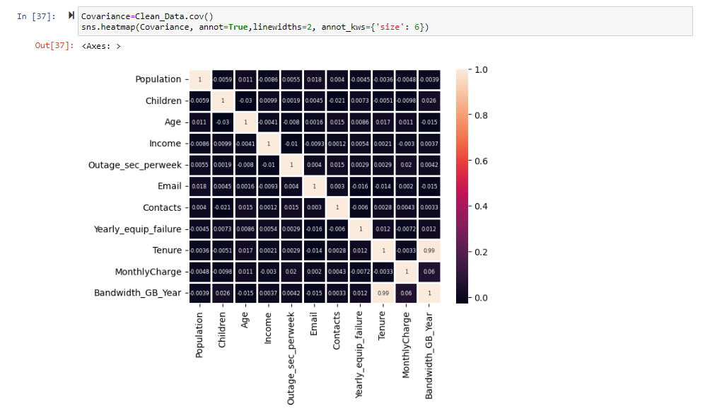
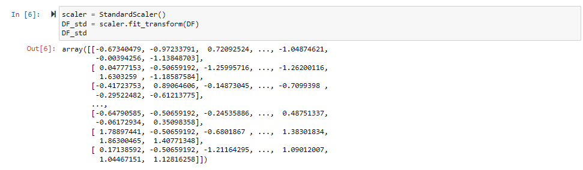
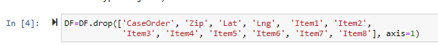
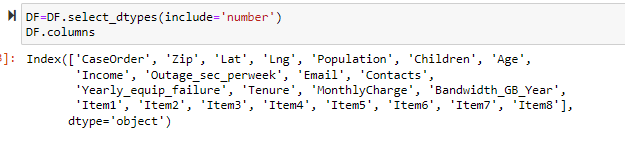
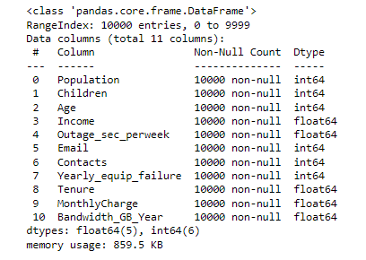

# Dimensionality Reduction Methods

While excess data is certainly better than not having enough data, the inclusion of unnecessary or redundant fields can cause errors with models, poor accuracy, and by extension, wasted business resources. To that end, it is important to determine which fields are the most useful. This leads to an important question, which fields should be kept?

The goal of the data analysis is to use PCA to determine the number of principal components as well as which fields to keep within the dataset for future business analyses.

PCA analyzes the selected data according to variance and assigns n-numbered principal components based on the variance. PCA will output a principal component for each variable in the dataset along with its respective explained variance. From there, the number of principal components to be retained can be determined based on the number of principal components desired, the cumulative explained variance desired, or via a line chart and using the elbow method. It is expected that the retained principal components can explain most of the variance in the dataset while reducing dimensionality and maintaining accuracy (GeeksforGeeks).

PCA assumes that standardized data is used as PCA is “sensitive to the scale of features” (Keboola). Prior to analysis, the features will be standardized to prevent any issues arising from lack of standardization.

The continuous data set variables that were kept are shown in the pic below.

These features were determined firstly by only selecting variables that were numeric.

After the data frame contained only numeric data, variables that were not continuous and variables that are not relevant to the analysis were dropped.

CaseOrder was dropped as it is used as primary key/index in the current dataset. Zip is not continuous, but nominal. Latitude and longitude were dropped as independently their value is limited since together, they function as a set of coordinates. Lastly, Item1 – Item8 were dropped as they are categorical ordinal data coded as numbers. The numbers have no direct or mathematical relationship, only that 1 is the highest and 8 is the lowest, but not by a truly quantifiable amount.

The cleaned data set was standardized as seen in the screenshot below.

The matrix of all the principal components was determined as shown below. The covariance for all principal components is low except for ‘Tenure’ and ‘Bandwidth_GB_Year’.

The total number of principal components is subjective and there is often merit in arguing for either higher or lower numbers. In this case, the number is determined using the elbow rule as a baseline. As shown in the chart, there are two bends and the second bend, 10 principal components, is the cutoff chosen for this analysis. Typically, with the elbow rule you would choose the first bend, however in this case, the first bend only contains 2 principal components and 27.74% of all variance. The next 8 principal components contribute around 9% to the total variance until drastically falling off to below .1% on the 11th principal component.

The variances of each of the principal components are listed below. Each principal component is represented by a number with a space separating them. The first principal component explains 18.13% of the total variance.

The total variance captured by all 11 of the principal components in the dataset adds up to 100%, however with the 10 chosen, they account for 99.95% of all of the variance.

According to the scree plot using the elbow method there are two bends at which can be chosen, 2 or 10. The first bend only accounts for 27.74% of all variance, while the second bend accounts for 99.95%. With the first bend accounting for such a small proportion of the total explained variance, and with principal components 2 through 10 being within 1% of each other, it makes sense for the cutoff to be at the second bend. The second bend reduces the data by 1 dimension while losing only 0.5% of all explained variance. This reduction, while small, does reduce the original model by 9.09% with a very negligible loss in explained variance.

E.  Websources:

Choosing the number of components. Python. (n.d.). https://campus.datacamp.com/courses/dimensionality-reduction-in-python/feature-extraction?ex=15  (Scree plot and pipeline)

PCA explained variance. Python. (n.d.-b). https://campus.datacamp.com/courses/dimensionality-reduction-in-python/feature-extraction?ex=8 (Explained variance)

F.  Sources:

GeeksforGeeks. (2023, August 1). Principal component analysis(pca). GeeksforGeeks. https://www.geeksforgeeks.org/principal-component-analysis-pca/#).

A guide to principal component analysis (PCA) for Machine Learning. A Guide to Principal Component Analysis (PCA) for Machine Learning. (n.d.). https://www.keboola.com/blog/pca-machine-learning

