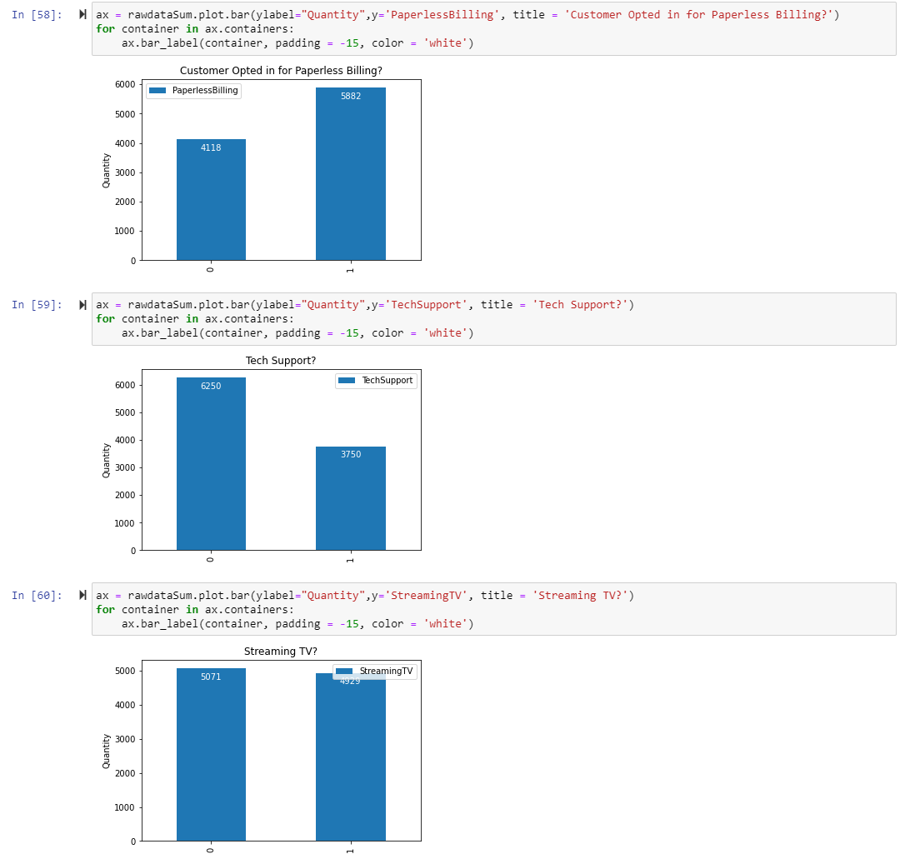

# Multiple Regression for Predicting Customer Bandwidth Usage

Given the information collected regarding customers, what is the expected data usage (in gigabytes per year) of the customer?

The objective of this data analysis is determining the expected data usage a customer is predicted to have given the collected data regarding services and factors surrounding service such as demographic data. With this information, the company can better identify “power users”.

In multiple regression models there are five main assumptions. The five are linearity, homoscedasticity, independence, normality, and no multicollinearity (Bedre, 2021). The first assumption, linearity, assumes that a linear relation exists between predictor and response variables. Homoscedasticity assumes a constant variance. Independence assumes the “observations are independent’ (Zach, 2021). Normality assumes normally distributed residuals.  Lastly, no multicollinearity assumes that the predictor variables are not strongly correlated with one another.

Python was chosen due to the expansive list of libraries, my familiarity with the program, and the usefulness of Jupyter notebooks, which allows me to segment the code and document it for the assignment more easily. This segmentation also allows me to troubleshoot and revise the code more easily as needed. Python is a very capable program with libraries such as seaborn, scikit, and pandas that allow for the generation, comparison, and analysis of the multiple regression models utilized below.

Multiple regression is an appropriate technique as it measures the variation of the dependent variable, in this case data usage per year, using two or more independent variables, the services or characteristics regarding the customer’s services. This will allow the impact to be measured with more accuracy and with a model that is more complex than a single regression (Basics of multiple regression and underlying assumptions). This also allows for a prediction regarding a continuous dependent variable unlike something like a logistic regression. This is important as the dependent variable being researched is data usage per year, which is continuous.

The goal of data preparation is to ensure the data is not only clean but trimmed down into a more useable format via dimension reduction, coding the categorical variables, and dropping unnecessary variables.  The first thing to be done is to check for duplicates and nulls. After ensuring that there are no nulls or duplicates, columns with data that is too specific/not needed for the analysis such as ‘Churn’ will be removed.  The remaining columns are then checked for outliers. Afterwards categorical predictor variables are handled one of three ways. Firstly, those with more than two categories, such as the ‘Marital” variable are coded into zeroes and ones, depending on whether the variable is true for the customer. In the ‘Marital’ variable example, the customer will have a 0 if they are anything but presently married, and a 1 if they are presently married. Other predictor variables with more categories, such as ‘Internet’, are coded into categorical variables with 0 representing no internet and 1 and 2 representing fiber optic and DSL respectively. The remaining variables are converted from yes/no to 1/0 with 1 representing yes/true and 0 representing no/false.

The target variable is ‘Bandwidth_GB_Year’ which is continuous and stored as float64. The predictor variables can be seen below with each object datatype representing categorical variables, and the float and int datatypes representing continuous and ordinal variables. There are 50 variables over and 10,000 entries.

To prepare the data for analysis, the first steps are to import the libraries that will be used, importing the CSV, and checking the data for nulls and duplicates.

After this, the values in each column are checked and unnecessary variables ('Customer_id', 'Lat', 'Lng', 'County', 'Zip', 'Interaction', 'CaseOrder', 'Job', 'UID', 'City', 'Area',  'State', 'TimeZone', and 'Churn') are dropped prior to any transformation.  The remaining variables are then checked for information that is very obviously incorrect, such as income being negative, age being below 18, etc.

Once the information is verified to not be wildly incorrect, the transformation process begins. Categorical variables such as ‘Gender’, ‘Marital’, and ‘InternetService’ are converted into numerical categorical variables. The ‘Gender’ and ‘Marital’ variables were reduced down to whether the customer is a male/married resulting in a 1, and if the customer is not, then the category is coded as a 0. The ‘InternetService’ variable was not reduced in this way but did have the categories coded to values between 0 and 2, with 0 representing no internet, 1 representing fiber optic, and 2 representing DSL.

Variables with that were exclusively yes and no were all coded with 0 representing a no, and 1 representing a yes. ‘Contract’ and ‘PaymentMethod’ were reduced a similar way to the ‘Gender’ and ‘Marital’ variables. ‘Contract’ now represents whether the customer is in a contract of any length, resulting in a 1, or not in a contract and resulting in a 0. ‘PaymentMethod’ was reduced to representing automatic payments only. If the payment is automatic, the value will be stored as a 1, and if the payment is anything else, it results in a 0.

Lastly, the survey results represented by the columns beginning with “Item” were renamed to what factors they respectively represented in the survey.

Univariate Continuous:

Univariate Categorical:

Univariate Ordinal:

Bivariate:

The initial multiple regression model:

y=406.1336 + 0.00001635 * Population + 30.9216 * Children - 3.2487 * Age + 0.00004542 * Income  - 0.1575 * Outage_sec_perweek - 0.0448 * Email - 0.4848 * Contacts - 0.78 * Yearly_equip_failure  + 2.9189 * Techie + 1.761 * Contract -2.092 * Port_modem - 0.7763 * Tablet - 3.0216 * Phone 216.2983 * Multiple + 86.2803 * OnlineSecurity + 194.2995 * OnlineBackup + 140.3715 * DeviceProtection + 62.8376 * TechSupport + 416.5198 * StreamingTV + 443.1901 * StreamingMovies + 0.2477 * PaperlessBilling 81.9284 * Tenure - 4.4564 * MonthlyCharge 65.0513 * Male + 1.1576 * Married + 245.5081 * Internet -1.8005 * Automatic Payment - 2.8373 * Timely Response 2.0768 * Timely Fixes + 0.8151 * Timely Replacements + 0.674 * Reliability + 1.0233 * Options - 0.6649 * Respectful Response 0.2906 * Courteous Exchange - 0.1305 * Active Listening

The revised multiple regression model:

y= 55.586 + 30.6111 * Children - 3.2756 * Age + 3.0394 * Contract + 72.0464 * OnlineSecurity + 93.4932 * OnlineBackup + 84.2807 * DeviceProtection + 9.065 * TechSupport + 229.179 * StreamingTV + 210.1029 * StreamingMovies + 81.9238 * Tenure + 66.6457 * Male + 230.4913 * Internet

Variable Selection and Analysis:

For the first selection procedure, all predictor variables with a P>|t| greater than .05 were excluded. This left only variables that are statistically significant and narrowed it down a bit, however the large condition number needed to be evaluated to ensure the strong multicollinearity had also been reduced. For this, eigenvalues were checked, and the predictor variables with the lowest eigenvalues were excluded.

This resulted in the predictor variables ‘Multiple’, ’MonthlyCharge’, ’Timely Fixes’, and ‘Timely Response’ being dropped.

After the selection is completed, we are left with a much lower condition number, a new more reduced equation, and the primary evaluation metric in this comparison, the R² value has only slightly decreased from 0.999 in the first model to 0.997 in the current model. The revised model’s explanatory power regarding the variance has only decreased by 0.2%.  The residuals are slightly further off from what is expected as can be seen in the models’ respective scatterplot and with the larger mean absolute error in the revised model. However, as denoted by the scatterplot, the data appears to be more random and less bunched up than it was the initial model with the high condition number.

The final linear regression model uses coefficients that are all statistically significant. According to the revised model, data usage is predicted to change in the following ways based:

+ 30.6111 per child

- 3.2756 per year old the customer is

+ 3.0394 if the customer is in a contract

+ 72.0464 if the customer has opted in for OnlineSecurity

+ 93.4932 if the customer has opted in for OnlineBackup

+ 84.2807 if the customer has opted in for DeviceProtection

+ 9.065 if the customer has opted in for TechSupport

+ 229.179 if the customer has opted in for StreamingTV

+ 210.1029 if the customer has opted in for StreamingMovies

+ 81.9238 per month increase in Tenure

+ 66.6457 if the customer is Male

+ 230.4913 based on the Internet type

The clearest limitation of this analysis is the sample size. A larger more robust sample will result in an analysis that is more representative. Another limitation are factors regarding usage that I believe would be important, such as whether the customer works from home, livestreams, or games. These are usage scenarios which could drastically increase the data used.

Recommendation:

Reflecting upon the information collected from the analysis, it is suggested that company collects more information regarding high usage activities such as working from home, livestreaming, or gaming to better market and better identify “power users”. The company should also explore investing in more bandwidth for areas with more children in the home, as well as areas with a higher-than-average tenure, as there is a positive correlation between tenure length and data usage. The connection between tenure length and data usage also needs to be explored more in depth to determine whether it is causal or mere correlation.

Code Sources:

Bedre, R. (2021, April 25). Multiple linear regression (MLR). Data science blog. https://www.reneshbedre.com/blog/multiple-linear-regression.html

GeeksforGeeks. (2022, July 11). Multiple linear regression with scikit-learn. GeeksforGeeks. https://www.geeksforgeeks.org/multiple-linear-regression-with-scikit-learn/#

Sources:

Basics of multiple regression and underlying assumptions. CFA Institute. (n.d.). https://www.cfainstitute.org/en/membership/professional-development/refresher-readings/multiple-regression#:~:text=Five%20main%20assumptions%20underlying%20multiple,whether%20these%20assumptions%20are%20satisfied

Bedre, R. (2021, April 25). Multiple linear regression (MLR). Data science blog. https://www.reneshbedre.com/blog/multiple-linear-regression.html

Zach. (2021, November 16). The five assumptions of multiple linear regression. Statology. https://www.statology.org/multiple-linear-regression-assumptions/

