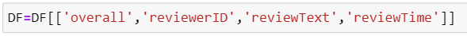

**Review Categorization: Data Analysis Report And Executive Summary**

**Hunter James**

**Table of Contents**

1\. **Introduction and Research Question** \...\..... Page 1

2\. **Data Collection**
\...\...\...\...\...\...\...\...\...\...\...\...\...\... Page 1

3\. **Data Extraction and Preparation** \...\...\...\...\... Page 2

4\. **Analysis**
\...\...\...\...\...\...\...\...\...\...\...\...\...\...\...\...\....
Page 19

4.1 Model 1 (5 labels) \...\...\...\...\...\...\...\...\...\.... Page 19

4.2 Model 2 (3 labels) \...\...\...\...\...\...\...\...\...\.... Page 23

4.3 Model 3 (2 labels) \...\...\...\...\...\...\...\...\...\.... Page 26

5\. **Application**
\...\...\...\...\...\...\...\...\...\...\...\...\...\...\...\... Page 29

5.1 Application Creation \...\...\...\...\...\...\...\...\... Page 29

5.2 Application Visuals and Usage\...\...\...\.... Page 34

6\. **Data Summary and Implications** \...\...\...\.... Page 36

7\. **References**
\...\...\...\...\...\...\...\...\...\...\...\...\...\...\..... Page 37

7.1 Text References...\...\...\...\...\...\...\...\...\...\.... Page 37

7.2 Code References \...\...\...\...\...\...\...\...\...\.... Page 38

**Introduction and Research Question**

 

For businesses, data is worth its weight in gold. Fortunately, many
sources of data are quite easily available. Unfortunately, these data
sources are not always comparable or standardized. A good example of
this is customer reviews and customers' thoughts on a product. This data
can take the form of Amazon (or various other websites) reviews,
text-to-speech data from call centers where customers might speak
positively or negatively about a product, surveys given to customers, or
data collected by platforms such as Sprinklr that search the web for
certain keywords determined to be related to the products of interest.
While there can certainly be arguments to be made concerning
comparability between websites' reviews, not all reviews have the same
rating system and even if the websites do have the same rating system,
the demographics of the shoppers are not necessarily the same. This is
especially true for regional stores or more niche stores such as
Microcenter which only have a handful of locations in specific states
and are better known among more tech-oriented people; the average
Microcenter shopper is not necessarily representative of the average
Amazon electronics shopper and vice-versa. There are many ways to
standardize such data, however, with large datasets, this can be
extremely time-consuming, and the benefits of automation become
extremely evident. The method of standardization attempted will involve
training a recurrent neural network model to accurately predict the star
rating of Amazon reviews to then utilize the model to not only
automatically label unseen Amazon reviews, but also to label reviews and
similarly purposed data to the Amazon star rating scale. Is it possible
to correctly predict the star rating assigned to an item over 90% of the
time based on the content of the review by using a recurrent neural
network model? In this analysis, this question will be explored with the
alternate hypothesis being that such a model is possible, and the null
hypothesis being that such a model is not possible.

 

**Data Collection**

The accessible dataset for Amazon reviews from the University of
California San Diego was used for this analysis. The already compiled
data was used as gathering Amazon reviews in mass is not as simple as
scraping the website since Amazon times out connections that connect too
many times too fast. This only realistically leaves the options of
utilizing an existing dataset, spending an increasingly large amount of
time evading the timeouts via waiting or utilizing additional services,
or paying Amazon to access their API. Out of the above options, using
already gathered data made the most sense for this analysis. The
original dataset containing all the reviews that were collected is over
200 million records and 32 gigabytes in size while zipped.
Unfortunately, this is a bit too large to be practical on consumer-grade
equipment, so the 5-core subset that only contains reviews from the
electronic section was used. This dataset is still quite large at over 6
million reviews while still being reasonably usable and manipulatable.
The primary disadvantage of using an already gathered dataset is that
there is less control over the aspects of the data stored; the data will
have unneeded columns included and could potentially be lacking
information that could help with further or deeper analyses.

 

**Data Extraction and Preparation**

Throughout the data extraction and preparation process, Python via
Jupyter Notebook was leveraged. Jupyter Notebook, despite the larger
file sizes of projects, was used due to the ability to quickly iterate
on code, being able to troubleshoot and interact with the outputs more
quickly due to the cell segmentation. Python was used because of
familiarity with the language, its speed, and its integrability with the
neural network portion of the analysis even though Python can consume a
lot of memory when dealing with large datasets.

For data extraction, the function provided on the dataset website was
used. The.json.gz file was loaded into a pandas dataframe.

Next, DF.info command was run to get a glance at the newly loaded pandas
dataframe as well as to determine which columns contain the most
pertinent information.

The shape and the info of the dataframe were checked.

The 'reviewTime' column was then converted to the datetime datatype from
being an object. Right after the conversion, as there were reviews from
at least 1999, a mask was applied to only keep reviews between the
beginning of 2008 and the end of 2018. After the mask was applied, the
shape was checked to see how many rows were removed.

The dataframe was checked for nulls, with the only columns whose nulls
were of importance being the 'overall' column and the 'reviewText'
column. The nulls were then dropped in the 'reviewText' column and then
the nulls were checked again just to make sure that everything was
dropped successfully.

The 'vote', 'verified', 'unixReviewTime', 'asin', 'reviewerName',
'summary', and 'image' columns were all dropped as they are not relevant
to this analysis. DF.info() was then called to check that only the
expected columns remained in the dataframe.

 

The dataframe was checked for duplicates based on the 'reviewText' and
'reviewerID' columns. These two columns were chosen together as shorter
reviews can be duplicated without it being intentional; two separate
reviewers could write "good", "performs as expected", etc. with it being
just a common short review and not necessarily something that needs to
be removed. Of course, the same logic could be applied to reviews by a
particular reviewer, however since the text is identical and the
reviewer is the same, the reviews may be posted by bots, or the reviewer
could have a generic text that gets copy-pasted into reviews. Since
700,000 rows are duplicates, the first will be kept and the rest will be
removed to not skew the model.

The count of the values within the 'overall' column is checked and then
the dataframe is reselected to have a proportionate amount of 1-5
ratings. 2.0 had the fewest rows at 283,176 and as such any amount below
this quantity could have been selected for the reselection. 250,000 was
chosen a little arbitrarily; it is quite close to the max of 280,000
while being a nice round number.

 

The dataframe is then checked to ensure that the previous operation was
successful.

As shown in the above step, the style column is stored as rows of
dictionaries containing product information. This dictionary will be
broken down and converted into separate columns to check information
about the products being reviewed. First, the keys in the dictionary in
each row are stored in a set. Then a function is defined and applied
where each row is parsed through sorting each key into a new column and
the accompanying information into the relevant column in the appropriate
row.

 

DF.info() is called to check the added columns and the amount of
non-null information in each one.

 

Next the pandas display.max_rows option is set to none so that I can
inspect the 'Style:' column as it had one of the highest quantities of
non-null values. The value count of the 'Style:' column was then printed
and can be seen below, there is a large variety of products. The pandas
display.max_rows option was then set to 100 to reduce clutter on the
screen in the following steps.

 

The dataframe was then set to only include the columns that will be
relevant for the rest of the analysis.

 

Now the text processing begins. An additional column is created and
overwritten in the various steps to ensure that the text is cleaned of
any unwanted characters. Respectively, all the letters, numbers,
punctuation, and escape sequences alongside whitespace are removed. When
the new column called 'Unusual' is printed, there appears to be nothing,
however after performing value_counts() on the column, there are a
handful of rows with characters that don't display correctly.

 

These characters are then converted to a list and removed in the same
way as numbers, letters, and punctuation in the previous step, and the
value count of the 'Unusual' column is checked again.

 

After being verified that all unexpected characters are parsed out, the
column is dropped and .info() is called to verify the column was dropped
correctly.

 

The steps to remove the punctuation, numbers, escape sequences, and
characters that could not be displayed were repeated and applied to the
'reviewText' column, creating the new column 'ReviewsNoPunct'.

 

The variables were cleared to free up some memory.

The new column, 'ReviewsNoPunct', is printed for a quick visual check of
the rows that are displayed.

 

The list of stop words from the NLTK module is then printed in
preparation for the next step, the 'reviewText' column is dropped and
DF.info() is called to verify that the column was dropped.

 

Next, the lemmatizer is initialized, the stop words list from NLTK is
assigned to a variable called stop_words and negation words from the
stop words list are stored in a list called negationwords. The
stop_words list compares each word in the original list to words in
negationwords and only keeps words that are not in negationwords. A
lemmatizer was used instead of a stemmer because while lemmatizing takes
longer, the process returns an actual word, whereas a stemmer, while
faster, only removes "suffixes from the end of word tokens" (IBM).

 

A function is then defined and applied to the 'ReviewsNoPunct' column
that converts the text to lowercase, tokenizes the text, creates a list
called 'cleaned_text', and each token that is not in the stop_words list
is then iterated through. The function concatenates words that also are
in the negationwords list with the word that follows and if the word is
not in negationwords or if there are no words after the negation word,
then the text is lemmatized and added to the list. The negation words
were concatenated to maintain context. In my testing, this method of
negation handling provided better results when it came to validation
accuracy as opposed to leaving the negation word as is or removing the
negation word via the standard stop word filtering process.

 

The 'Review_Cleaned' column is then printed to quickly check that
everything completed as expected.

 

A column called 'TokenLen' is created that stores the number of tokens
in a cleaned review. The minimum number of tokens was checked and then
rows at that quantity, 0, are printed. Since there didn't seem to be any
pertinent information in these rows, they were filtered out.

A new column, 'lang', was created that stores the results from applying
the detect function from the langdetect module. The counts of each value
were then printed.

A preview was printed that shows rows where the language is not labeled
as 'en', or English. As can be seen in the screenshot below, there are a
lot of incorrectly labeled reviews. Since there are a lot of incorrectly
labeled reviews, reviews that are labeled as 'es', or Spanish, were
checked as Spanish is quite common in the US and more likely to be
correctly labeled. As shown below, some reviews are incorrectly labeled,
but many are correctly labeled.

 

From the value counts in a previous step, 'af' was the second most
common. For verification purposes, the dataframe rows where lang equals
'af' was displayed and all the rows shown are incorrectly labeled.

 

The dataframe was filtered to exclude any row where lang equals 'es',
and the 'lang' column was dropped.

 

The 'TokenLen' column was written over and recreated since rows were
dropped in the previous step involving the 'lang' column. The maximum
number of tokens, minimum number of tokens, average number of tokens,
and standard deviation of the number of tokens were printed. A variable
called TokenLen was set to store the value of the rounded average number
of tokens. The 'TokenLen' column's value counts were printed, the pandas
option for max rows to display was set to none so that all print and can
be visibly inspected and this option was set back to 100 after.

 

The dataframe was printed where 'TokenLen' equals 1 to ensure that the
values look reasonable. As shown below, the values are reasonable, can
be expected in a review, and also demonstrate that the negation handling
from the previous steps worked.

The counts of the values in the 'overall' column were printed, and two
new columns were created based on the values in the 'overall' column.
For the 'Sentiment' column, 1.0 and 2.0 were mapped to negative, 3.0 was
mapped to neutral, and 4.0 and 5.0 were mapped to positive. For the
'NoNeutralSentiment' column, 1.0, 2.0, and 3.0 were mapped to negative,
and 4.0 and 5.0 were mapped to positive.

The counts for the values in both new columns were printed and the
current dataframe was copied and resampled into two new dataframes. The
first new dataframe, DFNeutral, was resampled so that the three values
in the 'Sentiment' column have 170,000 rows each. The second new
dataframe, DFPosNeg, was resampled so that both values in the
'NoNeutralSentiment' column have 370,000 rows each. Lastly, the original
dataframe was resampled so that each value in the 'overall' column has
160,000 rows. This was done so that way the model is fed an equal number
of values from each possible label and does not skew to one value. The
value with the fewest rows in each column was used as the quantity for
the minimum and separate dataframes were created because the resampling
of one would make the other two columns imbalanced.

The 'overall' column was then one-hot encoded and replaced with 5
columns representing each of the possible 5 values in the column.

 

The tokenizer from the Keras library was used due to ease of use and
reliability. The tokenizer does have limitations, notably the need to
preprocess the text before tokenization and the difficulty of processing
non-Latin alphabet texts (Menzli, 2023). The tokenizer was initialized
and fit on the column that contained the clean tokens, 'Review_Cleaned'.
Each row was converted to a list, and each list was then converted to a
sequence. DF.info() was printed to verify the above changes.

 

The X and y variables are created with X being the padded sequences and
y being mapped to the columns that store the labels for each sequence.
The sequences were padded with zeroes added after the text to a max
length of the 'TokenLen' variable that was created in a previous step,
40. Two columns were dropped, warnings were turned back on, a value
stored in X was printed to demonstrate the padding, and X and y were
split into train and test sets. The portions regarding the X and y
variables, training and test splits, one-hot encoding, as well as the
tokenizer portion of the previous step were repeated two more times for
each of the two other dataframes previously created.

 

 

 

**Analysis**

 

Histograms were created and printed that show the TokenLen for each
value in the 'overall' column. As can be seen overall 5.0 has a
significant number of reviews with a smaller number of tokens, while
having fewer reviews with a larger number of tokens. Overall 4.0 has
noticeably more in the 170 to 300 range, while Overall 2.0 has a
significantly more gentle slope decline as compared to Overall 5.0.
While histograms can simplify the visualization of data too much at
times, they are very useful for getting an overview of the distribution
of the data. As shown in the graph below, even though it is not super
easy to tell where one bin begins and the other ends, and the x axis was
truncated, histograms provide a very informative and comparative
overview of the distributions of the number of tokens.

>  

**First Model -- 5 label star model:**

The first model is comprised of four layers, constructed as a sequential
model, and is initially loaded on the CPU. The actual fitting and
execution of the model is done on the GPU. A GPU is significantly faster
than a CPU for tensorflow but is typically unable to store all the
model's information due to having a smaller RAM capacity than the
overall system. The first layer is an embedding layer which reduces the
dimensionality of the data. A pre-trained embedding layer, such as
Word2Vec or GloVe, was not used because the performance, in my testing,
was worse. The second and third layers are bi-directional LSTM layers
which were used because, while slower than traditional LSTM layers
(Zvornicanin, 2023), these layers retain context throughout the text and
not just up to a certain point allowing Bi-directional LSTM to "capture
richer dependencies in the input sequence" (Anishnama, 2023). Tanh was
used for an activation function in the bidirectional LSTM layers because
in my experimentation it performed the best and was required for CuDNN
usage (Keras). 128 nodes were used on the first LSTM layer and 64 nodes
were used on the second LSTM layer. This was decided through
experimentation. 128 and 64 nodes had the best results in my testing
while not being unnecessarily slow. The last layer is the dense layer
which predicts the label. The softmax activation function was used
because the goal of the dense layer is classifying multiclass labels
into the most probable label (Arora, 2023).

An RNN was employed due to its capability to store information of
previously provided inputs to contextualize current and future inputs.
This allows the neural network to capture more nuance in sequential data
such as in sentiment analysis (Craig, 2023). Bidirectional LSTM was used
because, while slower than a simple LSTM, it allows the model to retain
both past and future context surrounding inputs. These were used instead
of something like BERT primarily because BERT is significantly slower
(Aswini, 2022). Running the above models with a reduced dataset and
increased batch size, to increase the time it took to optimize the
model, took around a minute per epoch. While with BERT, that same
dataset took over an hour per epoch which makes it too computationally
expensive for this analysis.

>  

A model checkpoint and early stopping were initialized based on the
validation accuracy. The model was compiled using the ADAM optimizer,
the categorical cross-entropy loss function, and accuracy as the metric.
The ADAM optimizer was used because it is standard and generally a good
optimizer and based on my testing, this was certainly the case.
Categorical cross-entropy was employed as the loss function because the
labels are multiclass categorical. Accuracy was chosen as the metric
because the goal is to train a model to have \>90% accuracy. The model
was then run and fit with a batch size of 32, eleven epochs, using the
test datasets for validation and 12 workers. A batch size of 32 was used
because while it is the default, on the smaller side for batches and
takes longer, a smaller batch size can lead to a better-performing model
while larger batch sizes may overfit or over-generalize (SabrePC). As
shown in the screenshot below, the model stopped running at the second
epoch instead of going all the way to the eleventh epoch to prevent
overfitting.

>  
>
>  

The accuracy, validation accuracy, loss, and validation loss were then
plotted in line graphs and shown below. As demonstrated in the graph,
the validation loss is slightly decreasing, and the validation accuracy
is slightly increasing throughout the execution of the model. The loss
was the highest on this model, out of the three models, and the accuracy
was the lowest.

>  

A heat map was created and plotted to show the model's predictions as
compared to the actual labels. The labels are all shifted down one from
the dataset labels, a 0 is actually a 1, a 1 is actually a 2, and so on.
As shown below, the model is most correct in the extremes, with 4 and 0
being the most accurate. 3 and 1 are the next most accurate,
respectively, with a 2 being the least accurate. The model also seems to
be quite good at determining the correct range as most of the incorrect
predictions are within one value of the actual prediction, but according
to the above screenshots and the classification report below, is not
very good at determining the single actual label.

> > 
>
>  

As previously mentioned, the model is best at correctly labeling reviews
with a label of 4, or 5 in the actual dataset, and worst at labeling
reviews with a label of 2, or 3 in the actual dataset.

> > 

**Second Model -- 3 labels Positive, Neutral, and Negative model:**

The second model was set up in the same way as the first model except
the dense layer which now outputs 3 different labels.

>  

The model is compiled in the same way as the first model.

>  
>
>  

The accuracy, validation accuracy, loss, and validation loss were then
plotted in line graphs and shown below. As shown below, the model's
validation loss decreased, and the validation accuracy increased until
the model finished running. The loss was lower on this model than the
5-label star rating model, but higher than the 2-label positive/negative
model.

>  

The same trend from the previous model continues with this model. The
closer the label gets to being the middle value, neutral, the worse it
performs. The model performs better at the extremes, positive and
negative, and worse at neutral. The model continues to be quite good at
determining the range of a label, within 1 label value, but is still
suboptimal at determining the correct single label.

> > 
>
>  

As mentioned, and shown in the heatmap, the model does much better at
correctly labeling 0, negative, and 2, positive, than correctly labeling
1, neutral.

>  

**Third Model -- 2 label Positive or Negative model:**

The third model is setup in the same way as the previous two models
except for the number of nodes in the LSTM layers and the dense layer's
activation function. As shown below, LSTM layers have 64 and 32 nodes
respectively, and the dense layer has an output of 2 different labels
with sigmoid as the activation function. The number of nodes was changed
because, during the testing phase of setting up the model, this node
quantity performed better. The dense layer's activation function was
changed from softmax to sigmoid because the dense layer now classifies
into binary labels instead of multiclass labels (Basta, 2020).

>  

The model is compiled in the same way as the previous models except the
loss is now binary cross-entropy. The change was made because the dense
layer now selects between two labels instead of multiple classes.

> > 
>
>  

The accuracy, validation accuracy, loss, and validation loss were then
plotted in line graphs and shown below. As shown below, the model's
validation loss decreased, and the validation accuracy increased until
the model finished running. The loss was a lot lower and the accuracy
was a lot higher than either of the preceding models.

>  

A heatmap was created and plotted and as can be seen below, the model
did quite a good job of correctly predicting the labels. The only
squares that have any color are the sections that line up with being
correctly labeled, while the squares that represent being incorrectly
labeled are completely black.

>  
>
>  

The classification report was printed and shown below. As mentioned in
the previous step, the classification report shows a relatively high
level of accuracy with an f1-score of 0.87 for both labels. The
precision for 0, negative, is slightly higher than it is for positive,
while the recall for 1, positive, is slightly higher than it is for
negative.

>  

**Application**

**Application Creation:**

While the 5-label star prediction model was not close to crossing the
90% threshold and neither of the two other models reached the 90%
accuracy threshold, the 2-label sentiment model was very close at an
f1-score of 87%. This score, while it could be higher, is high enough to
be utilized relatively accurately. To this end, an application was
created to apply the theoretical usefulness of the model to the real
world. This would allow an analyst with little to no Python experience
to quickly categorize reviews based on a trained sentiment analysis
model.

The GUI was built using the PySimpleGUI library for Python in Microsoft
Visual Studio. Python was used because of familiarity and its
simplicity, however, it is worth noting that there are other programming
languages that have faster execution speeds and offer the ability to
create apps. Visual Studio was used because most of the code is nested
and the troubleshooting benefits from Jupyter notebooks no longer apply
since most of the code needs to be run at once. The exe was created by
using the cx_Freeze library. A setup file, shown below, was created and
then the command "Python setup.py build" was run in the Anaconda
Powershell Prompt; this created the exe and stored the necessary files
alongside it.

 

The first thing done after importing the necessary libraries and
downloading the three items from NLTK is creating the initial window.
The window contains a section for selecting a file, a section for
entering the column name that contains the reviews, a checkbox for
indicating whether the reviews need to have the language checked, and
buttons for ok and cancel. The column name entry box was included
because the column name is likely not consistent and to maximize the
utility of the program and to ensure the correct column is analyzed,
this was needed. The checkbox for indicating whether the reviews are in
English was used because the detectlang library, as discussed above,
labels the languages of texts incorrectly relatively frequently. To
prevent unnecessary errors, the detect function can be turned on and off
at the user's discretion. The inputs from the file selection, column
name, and English checkbox are all referenced with keys and are then
stored as variables and called on for later portions of the code.

 

If the user wants to exit or cancel, then a popup appears confirming
this choice, and the program exits. If the user continues, then once a
file is chosen and the column name is input, a progress bar pops up that
updates throughout the code until the code is completed, an Excel file
is outputted, and the progress bar closes.

 

There are checks to make sure the user selects a file and inputs the
column name that contains the reviews.

 

The program begins processing the file by grabbing the file extension,
importing the file based on the extension, and then updating the
progress bar to 10%. NA values in the inputted column name are dropped,
and then processing of the data begins in the same way as the data was
processed before developing and training the models in section C.

 

The processing continues to ensure the data that is fed into the model
is similarly prepared to the original training and validation data
excluding the detect function from the langdetect library. If the
'LangCheck' variable, set earlier by the checkbox, is true, then this
step is skipped, if it is false then the function is run. The progress
bar is updated periodically so the user has an idea of how far along the
process is.

 

The sequences are padded to a length of 40 because, in the original
model, the training data was padded to a length of 40. The Keras model
is loaded, and the labels are predicted and converted to negative or
positive for easier readability. The progress bar is updated three times
throughout this process.

 

The columns created during the processing steps, aside from the
predicted label column, are dropped and the code checks if there is a
folder called "Labeled Reviews", if not, one is created.

 

A .xlsx file is printed in the current directory to the folder
created/checked for in the previous line, without an index, and the
progress bar is set to 100% and then closed.

 

A new window pops up informing the user that the file was processed and
then is closed after the user presses 'OK' or after the window is
closed.

 

The original window then closes.

 

**Application Visuals and Usage:**

The start screen that allows the user to select the files, input the
review column name, and indicate whether the reviews are in English
appears.

 

If the user hits the OK button without selecting a file, this popup
appears notifying the user and preventing the code from running.

 

After the user selects a file, if no column name is given for the review
text, a popup appears preventing progression and alerting the user that
the field is missing.

After both fields have data, a new window notifies the user that the
file selected will be processed.

While the file is processing, a progress bar appears that updates
throughout the code's execution until the file has been processed.

After the file has been processed, a new window appears and informs the
user that the file was processed. After the user clicks OK, both the
original window and the new window close.

 

**Data Summary and Implications**

Unfortunately, the results supported the null hypothesis in this
analysis. The 5-label star rating model was far from having 90%
accuracy, even in the best-performing labels. The 2-label
positive-negative model was the closest to 90% but was still unable to
cross the threshold. The performance was held back by two primary
factors. One is that the performance of consumer-grade hardware is
limited and that the time and resources needed to process such a large
dataset more deeply were not feasible in this analysis. The second is
that the dataset is too broad and narrowing the scope allows for more
accurate associations to be made with product-specific words.

 The dataset could be made more useful and accurate by narrowing down
the product categories of interest. As mentioned and demonstrated in the
data extraction and preparation section, there are a wide variety of
products included in the electronics section data, from Kindle and
hardcover books to cables, monitors, and routers. The hypothetical use
for a company is likely not going to involve every single product line
as even large electronics corporations such as LG, Samsung, Apple, Sony,
etc. do not cover every product line. There is also likely a separation
of product categories among company divisions that could further help
segment and increase the utility and accuracy of each model. Lastly,
there is the innate difference between reviewers. Reviewers might not
have the same baseline and might not interpret star ratings in the same
way. While 1-star and 5-star reviews are less debatable, a 3-star review
to one reviewer could be satisfactory whereas it could be below average
to another. This subjectivity can be shown from the survey data provided
by Go Fish where an overwhelming majority of customers, =\>95%, trust a
4 or 5-star product, an overwhelming minority, \<1%, trust a 1 or 2-star
product, while 28.7% of customers would trust a 3-star product (Jabbour,
2023). While less than 30% of customers trusting a 3-star product leans
towards a 3-star review being negative, it is numerically less decisive
than either end of the review spectrum. An audit of the review dataset
and a manual standardization of reviews to the same scale could increase
accuracy. Lastly, it would be interesting to obtain return information
in conjunction with a similarly focused review dataset that allows for
predicting product returns based on reviews. This would allow the
company to proactively target negative reviews below a certain threshold
to prevent reviews and get ahead of issues for poorly reviewed products.

Dataset improvements and changes aside, there are also possible
improvements to the model and processing of the data. It is possible
that a BERT model, which has a significantly larger corpus, could
perform better, however, on consumer-level hardware, it can be
prohibitively slow (an hour per epoch as opposed to a couple of minutes
per epoch) limiting its viability in this analysis and for many business
uses. There are also potential improvements to the processing of the
data via the implication of spellcheckers, different tokenization
methods, or different embedding methods. Two spellcheckers were applied
to the data in testing, the correct command from textblob and the
speller command from the autocorrect library, and in theory, these could
improve the accuracy of the model by reducing the number of tokens. In
practice, these spellcheckers are not always accurate and are
prohibitively slow even when the data is processed in parallel allowing
the spellcheckers to utilize more of the CPU. Different embedding
methods such as GloVe were tested and did not increase the performance
of the model, however, there are many different embedding methods, and
it is possible that a method that was not tried can increase
performance.

Model and dataset improvements aside, the 2-label model had relatively
reliable performance at an 87% f1-score and can be used to automate
sentiment labeling to a standardized scale. While the model might be
outcompeted depending on the use case, as it was only trained on Amazon
review data, the model still has its uses and to further this end, a
Python script utilizing the trained model was created and made into an
exe for easier deployment and utilization. The application can be
improved over time by updating and replacing the Keras model that is
called with practically no changes to the code itself as long as the
data processing steps don't change, and the length of the padded
sequences remains at 40.

**Sources**

**Text Sources:**

Anishnama. (2023, May 18). Understanding bidirectional LSTM for
Sequential Data Processing. Medium.
https://medium.com/@anishnama20/understanding-bidirectional-lstm-for-sequential-data-processing-b83d6283befc#:\~:text=The%20benefit%20of%20Bi%2DLSTM,dependencies%20in%20the%20input%20sequence.

Arora, A. (2023, May 22). Understanding logits, sigmoid, Softmax, and
cross-entropy loss in deep learning. W&B.
https://wandb.ai/amanarora/Written-Reports/reports/Understanding-Logits-Sigmoid-Softmax-and-Cross-Entropy-Loss-in-Deep-Learning\--Vmlldzo0NDMzNTU3#:\~:text=Softmax%20can%20also%20do%20the,to%20%E2%80%9Cpick%20a%20class%E2%80%9D
.

Basta, N. (2020, April 5). The differences between sigmoid and Softmax
activation function. Medium.
https://medium.com/arteos-ai/the-differences-between-sigmoid-and-softmax-activation-function-12adee8cf322

Craig, L. (2023, August 8). CNN vs. RNN: How are they different?:
TechTarget. Enterprise AI.
https://www.techtarget.com/searchenterpriseai/feature/CNN-vs-RNN-How-they-differ-and-where-they-overlap

Epochs, batch size, iterations - how they are important. SabrePC.
(n.d.).
https://www.sabrepc.com/blog/Deep-Learning-and-AI/Epochs-Batch-Size-Iterations

IBM. (n.d.). Stemming versus lemmatization. IBM.
https://www.ibm.com/topics/stemming-lemmatization#:\~:text=The%20practical%20distinction%20between%20stemming,be%20found%20in%20the%20dictionary.

Jabbour, D. (2023, September 25). 3-star reviews result in a -70%
decrease in trust \[data study\]. Go Fish Digital.
https://gofishdigital.com/blog/3-star-reviews-result-in-70-decrease-in-trust-data-study/

Keras. (n.d.). Keras Documentation: LSTM Layer.
https://keras.io/api/layers/recurrent_layers/lstm/

Menzli, A. (2023, August 11). Tokenization in NLP: Types, challenges,
examples, tools. neptune.ai. https://neptune.ai/blog/tokenization-in-nlp

R, A. (2022, November 4). How bert NLP optimization model works. How
BERT NLP Optimization Model Works.
https://www.turing.com/kb/how-bert-nlp-optimization-model-works

Zvornicanin, W. by: E. (2023, June 8). Differences between bidirectional
and Unidirectional LSTM. Baeldung on Computer Science.
https://www.baeldung.com/cs/bidirectional-vs-unidirectional-lstm#:\~:text=Finally%2C%20regarding%20the%20disadvantages%20of,if%20there's%20a%20real%20necessity.

**Code Sources:**

Create for loop to plot histograms for individual columns of DataFrame
with Seaborn. Stack Overflow. (1964, May 1).
https://stackoverflow.com/questions/50773877/create-for-loop-to-plot-histograms-for-individual-columns-of-dataframe-with-seab
-- Histogram Creation

Medium. (2023, July 30). Cx_Freeze: Freezing Python applications 🧊.
Medium.
https://medium.com/@HeCanThink/cx-freeze-freezing-python-applications-c5b87b1e0cdf
-- Cx_Freeze usage

Project, U. C. R. (n.d.). Amazon Review Data (2018). Amazon review data.
https://cseweb.ucsd.edu/\~jmcauley/datasets/amazon_v2/ - Dataset and
importation script

Select dataframe rows between two dates. Stack Overflow. (1961, February
1).
https://stackoverflow.com/questions/29370057/select-dataframe-rows-between-two-dates -
Select DF between two dates
